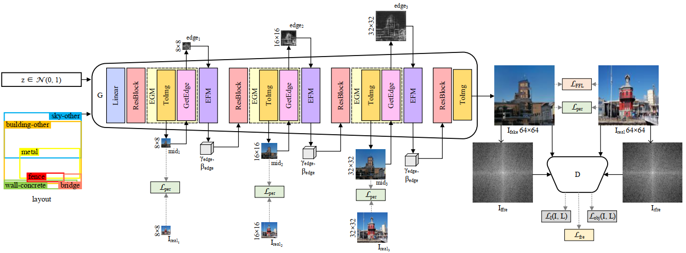
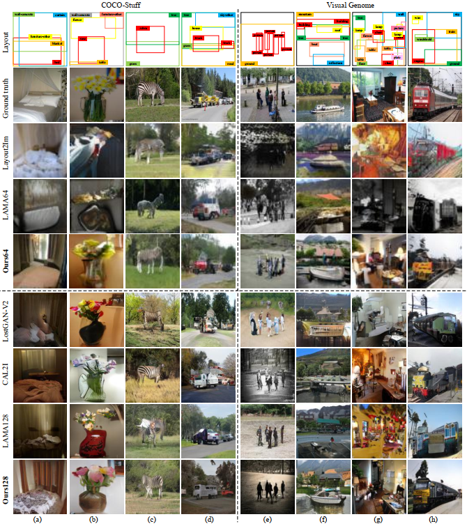
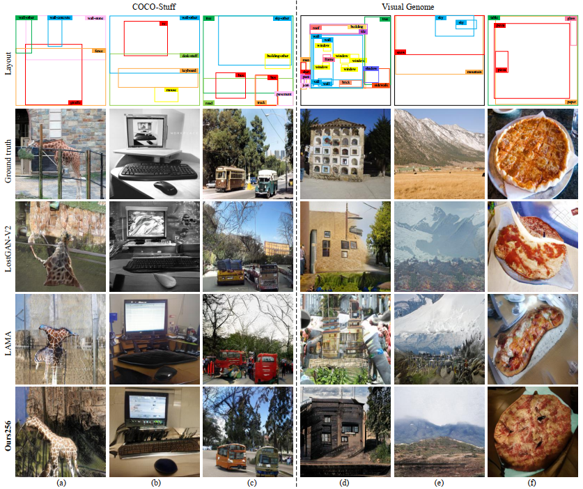

# EL-GAN 

This is a PyTorch implementation of our paper ***"EL-GAN: Edge-Enhanced Generative Adversarial Network for***
***Layout-to-Image Generation "***

## Network Architechture

The overview of our proposed EL-GAN (a version of fnal generated images with a resolution of 64×64)  is shown below.

<p align='center'></p>

## Preparation

### 1. Create virtual environment (optional)
All code was developed and tested on Ubuntu 18.04 with Python 3.8.5 (Anaconda) and PyTorch 1.7.1.

```bash
$ conda create -n EL-GAN python=3.8.5
$ conda activate EL-GAN
```

### 2. Clone the repository
```bash
$ git clone git@github.com:zhaobozb/layout2im.git ======================================待修改=============
$ cd EL-GAN
```

### 3. Install dependencies
```bash
$ pip install -r requirements.txt
```

### 4. Download datasets

To download [COCO-Stuff](http://cocodataset.org) dataset to `datasets/coco`:
```bash
$ bash scripts/download_coco.sh
```

To download [Visual Genome](https://visualgenome.org) dataset to `datasets/vg` and preprocess it:
```bash
$ bash scripts/download_vg.sh
$ python scripts/preprocess_vg.py
```

### 5. Download pretrained models
Download the trained models to `pretrained/`.
1. [trained model on COCO-Stuff
2. [trained model on Visual Genome

## Run codes

### 1. Test models

Test on the COCO-Stuff dataset:
```bash
$ python test.py --dataset coco --model_path pretrained/coco.pth --sample_path samples/coco/  =======待修改========
```

Test on the Visual Genome dataset:
```bash
$ python test.py --dataset coco --model_path pretrained/vg.pth --sample_path samples/vg/  ===========待修改========
```

### 2. Train models

Train on the COCO-Stuff dataset:

```bash
$ python train.py --dataset coco --out_path outputs/coco/
```

Train on the Visual Genome dataset:

```bash
$ python train.py --dataset vg --out_path outputs/vg/
```

## Results

### 1. Qualitative Results of Different Models (64×64 and 128×128)

Only Layout2Im [ZMYS19], LAMA64 [LWK∗21], and Ours64 images have a resolution of 64×64, and the rest are 128×128.  

<p align='center'></p>

### 2. Qualitative Results of Different Models (256×256)

All images are of 256×256 resolution.  

<p align='center'></p>


## Contact

If you encounter any problems, please contact us.
## Reference
Our project borrows some source files from LostGANs](https://github.com/WillSuen/LostGANs.git). 